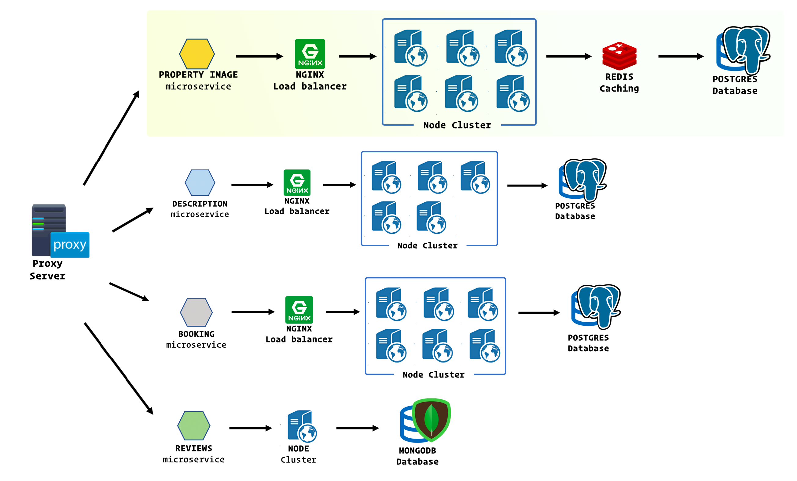

# Project


## Project description

Property Image Microservice of Lodged Rental Microservice

Built on Node, Express, Progres, Cassandra, Docker, AWS EC2, Nginx

Horizontally scaled, tested up to handle 1500+ events, 6000+ database writes per second


## Related Projects

  - https://github.com/Project-AirPods/image-carousel-module
  - https://github.com/Project-AirPods/booking-module
  - https://github.com/Project-AirPods/listing-description-module
  - https://github.com/Project-AirPods/review-module

## Table of Contents

1. [Usage](#Usage)
1. [Requirements](#requirements)
1. [Development](#development)

## Requirements

An `nvmrc` file is included if using [nvm](https://github.com/creationix/nvm).

- Node 6.13.0
- etc

## Development

### Installing Dependencies

From within the root directory:

```sh
npm install -g webpack
npm install
```

## Notes:

### List of run commands:
 - npm run eslint: run eslint and check for syntactical errors
 - npm run start (or npm start): run server and serve static assets
 - npm run dev: run server in development mode
 - npm run react-dev: run webpack and bundle files
 - npm run build: run webpack and build `bundle` file

